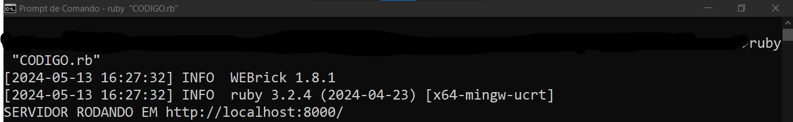

# MUNDO RUBY
👨‍💻VEJA UMA BREVE EXPLICAÇÃO SOBRE O "MUNDO DO RUBY". APLICAÇÃO FEITA COM RUBY/HTML/CSS.

 <br>
 <br>

## DESCRIÇÃO:
O aplicativo "MUNDO RUBY" é uma página web que fornece uma breve explicação sobre a linguagem de programação Ruby e sua capacidade de criar servidores web. Ele destaca as principais características e benefícios dela, bem como seu uso para desenvolver servidores web robustos e eficientes.

## EXECUTANDO O PROJETO:
1. **Instalação das Dependências:**
   Antes de executar o aplicativo, certifique-se de instalar as dependências do projeto. No terminal, navegue até o diretório `./CODIGO` e execute o comando abaixo para instalar as dependências necessárias:
   ```bash
   bundle install
   ```

2. **Subindo o servidor:**
   Após instalar as dependências, ainda no terminal e no mesmo diretório (`./CODIGO`), execute o seguinte comando para iniciar o aplicativo:
   ```bash
   ruby "CODIGO.rb"
   ```

   - Ou se preferir, basta apenas executar `./CODIGO/public/index.html` em um navegador da sua preferência! 😂

3. Após iniciar o servidor, acesse o projeto no navegador utilizando o seguinte URL: [http://localhost:8000/](http://localhost:8000/).

4. Leia a explicação fornecida sobre a linguagem de programação Ruby e sua capacidade de criar servidores web.

5. Se desejar, clique em `site oficial do Ruby` para acessar a documentação.

## NÃO SABE?
- Entendemos que para manipular arquivos em muitas linguagens, é necessário possuir conhecimento nessas áreas. Para auxiliar nesse aprendizado, oferecemos alguns subsidios disponíveis:
* [CURSO DE RUBY](https://github.com/VILHALVA/CURSO-DE-RUBY)
* [VEJA A DOCUMENTAÇÃO DO "WEBRICK"](https://docs.ruby-lang.org/en/2.4.0/WEBrick.html)
* [CONFIRA MAIS CURSOS](https://github.com/VILHALVA?tab=repositories&q=+topic:CURSO)

## CREDITOS:
- [PROJETO CRIADO PELO VILHALVA](https://github.com/VILHALVA)
- [PROJETO INSPIRADO NO "GOLANG WEB SERVER"](https://github.com/VILHALVA/GOLANG-WEB-SERVER)


